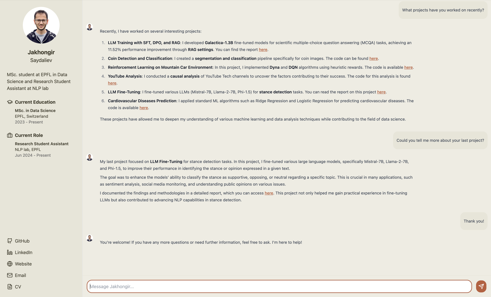

# Virtual Jakhongir - AI Assistant

A virtual assistant that simulates conversations with Jakhongir Saydaliev, powered by GPT-4. The assistant can answer questions about Jakhongir's professional background, education, skills, and experience.

Access it at [https://virtual-jakhongir.onrender.com](https://virtual-jakhongir.onrender.com)



## Features

- 💬 Real-time chat interface
- ⚡ Typewriter effect for responses
- 🧠 Conversation memory
- 📱 Responsive design
- 🎨 Clean and modern UI
- 🔄 Suggested questions

## Tech Stack

### Frontend
- React + TypeScript
- Tailwind CSS
- Lucide Icons
- React Markdown
- Vite

### Backend
- FastAPI
- LangChain
- OpenAI GPT-4o-mini

## Getting Started

### Prerequisites
- Node.js 16+
- Python 3.9+
- OpenAI API key

### Installation

1. Clone the repository

```bash
git clone https://github.com/yourusername/virtual-jakhongir.git
cd virtual-jakhongir
```

2. Install frontend dependencies

```bash
npm install
```

3. Install backend dependencies

```bash
cd backend
pip install -r requirements.txt
```

4. Create `.env` file in the [root](.) directory

```env
VITE_API_URL=http://localhost:8000
VITE_PORT=3000
```

5. Create `.env` file in the [backend](./backend) directory

```env
OPENAI_API_KEY=your_openai_api_key
PORT=8000
```

### Running the Application

1. Start the backend server

```bash
cd backend
python main.py
```

2. Start the frontend development server

```bash
npm run dev
```

3. Open http://localhost:3000 in your browser

## Project Structure

```
virtual-jakhongir/
├── src/
│   ├── components/
│   │   ├── Chat.tsx
│   │   └── Sidebar.tsx
│   ├── hooks/
│   │   └── useTypewriter.ts
│   ├── config/
│   │   └── api.ts
│   ├── types/
│   │   └── index.ts
│   └── App.tsx
├── backend/
│   ├── main.py
│   ├── prompt.py
│   └── requirements.txt
```

## License

This project is licensed under the MIT License - see the [LICENSE](LICENSE) file for details.

## Contact

Jakhongir Saydaliev - jakhongir.saydaliev@epfl.ch

Project Link: [https://github.com/Jakhongir0103/virtual-me](https://github.com/Jakhongir0103/virtual-me)

## TODO
- [ ] Function calling integration with an information about each project/education/experience as a tool
- [ ] Add animation effect to the profile picture
